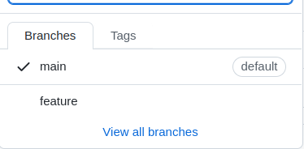
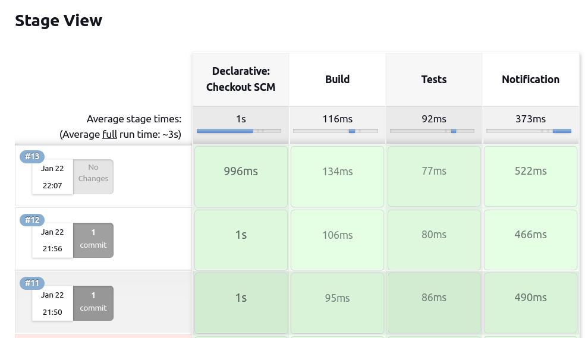
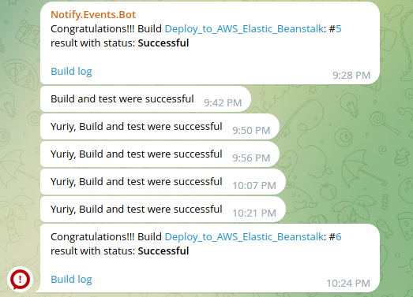
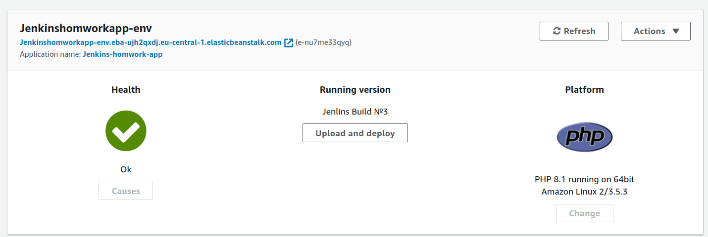
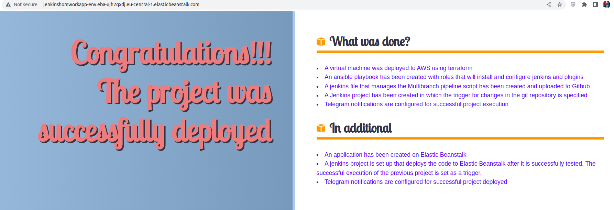

# Create Multibranch pipeline with the Jenkinsfile

To complete the task, I followed the following steps:
1. A virtual machine was deployed to AWS [using terraform](https://github.com/bugaenkoyu/Jenkins-pipeline/tree/main/terraform). 
Teraform created a security group, public ip, key pair, and also opened ports 22 and 8080.

2. In the next step, [I used ansible](https://github.com/bugaenkoyu/Jenkins-pipeline/tree/main/ansible) to configure jenkins and install all necessary plugins on it.

Using the following script, I created an admin user with help ansible.

```
#!groovy

import jenkins.model.*
import hudson.security.*

def instance = Jenkins.getInstance()

println "--> creating local user 'admin'"

def hudsonRealm = new HudsonPrivateSecurityRealm(false)
hudsonRealm.createAccount('admin','admin')
instance.setSecurityRealm(hudsonRealm)

def strategy = new FullControlOnceLoggedInAuthorizationStrategy()
instance.setAuthorizationStrategy(strategy)
instance.save()
```
Ansible downloaded the following script to the Jenkins server and after executing it installed all the necessary plugins.

```
#!/bin/bash
declare -a PluginList=(
    "github"
    "git" 
    "notify-events" 
    "awseb-deployment-plugin"
    "workflow-aggregator"
    "github-branch-source"
    "timestamper"
    "pipeline-stage-view"

)

for plugin in ${PluginList[@]}; do
   java -jar /home/vagrant/jenkins-cli.jar -auth admin:admin -s http://localhost:8080/ install-plugin $plugin
done
```
The picture shows which plugins I installed.


After that, I created a job that responds to the push to GitHub and performs the build and conditional tests.

I created a Jenkins file with two branches main and feature and launched it on github. After that I set up a webhook to notify jenkins about changes in the repository.




Jenkins tracks changes in each branch and processes the code after each push


The following picture shows how Jenkins informs about the successful completion of each step using the Pipeline stage view plugin.



The last step is the notification in Telegram, which I configured using the Notify.events plugin.



In addition, I configured another job that monitors the execution of the previous one, and if successful, takes the [project](https://github.com/bugaenkoyu/Jenkins-pipeline/tree/main/my_project) and uploads it to Elastic Beanstalk.


Previously, I brought up there and configured the server



If successful, the project is uploaded to Elastic Beanstalk and we can see the changes.

